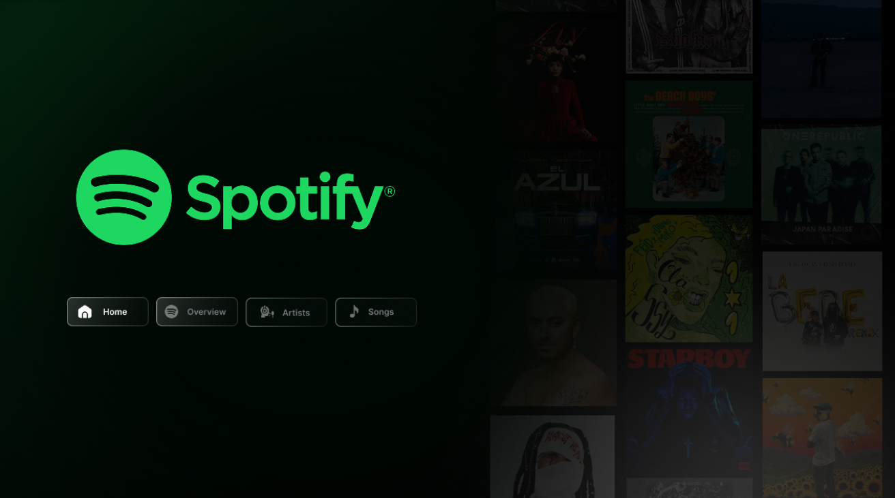

# 🎵 Spotify Top 50 Global Analysis — Data Analytics Project

## 👤 **By: Sneha Ghosh**  
🔗 **LinkedIn:** [Sneha Ghosh](https://linkedin.com/in/sneha-ghosh-72429a294)

---

# 🌍 **Why Spotify Matters to This Generation**
Spotify has become the **heartbeat of modern music consumption**, shaping how millions discover, stream, and connect with artists worldwide.  
For today’s generation, Spotify is:

- A **personalized music companion** powered by recommendation algorithms  
- A gateway to **global culture** and diverse artists  
- A space where music virality is **driven by data**  
- A platform that fuels the careers of emerging artists  

It influences our moods, productivity, creativity, and everyday life.

---

# 🎧 **What Is Spotify?**
Spotify is the world’s leading audio streaming platform offering:

- 100M+ songs  
- AI-based personalized recommendations  
- Public and user playlists  
- Global and regional Top Charts  
- In-depth artist analytics  

It generates enormous datasets on popularity, music trends, listening behavior, and audience preferences.

---

# 📊 **Why Combine Spotify + Data Analytics?**
Music in 2025 is **data-driven**.

This project merges Spotify streaming data with analytics to:

- Identify **top artists & top songs**  
- Understand **popularity trends**  
- Compare **explicit vs non-explicit content**  
- Analyze **song duration patterns**  
- Decode what listeners truly prefer globally  

This demonstrates my strength in **data storytelling, dashboarding, and insight generation**, making this project recruiter-ready.

---

# 📁 **Project Files Included**
- `Top50-Spotify.csv` — Raw Dataset  
- `Top50-Spotify.pbix` — Complete Power BI Dashboard  
- `Screenshot1`, `Screenshot2`, `Screenshot3`, `Screenshot4` — Dashboard visual previews

---

# 🛠️ **Tools & Technologies Used**
- **Power BI Desktop**  
- **DAX (Data Analysis Expressions)**  
- **Power Query**  
- **CSV Dataset**  
- **GitHub for Version Control**

---

# 🎯 **Project Requirements Covered**
- Cleaned and transformed Spotify dataset  
- Built a KPI-rich dashboard  
- Created DAX measures to calculate:  
  - Popularity metrics  
  - Explicit/Non-Explicit trends  
  - Duration analysis  
  - Artist-level insights  
  - Album type distribution  
- Delivered business insights for real-world decision making

---

# 📌 **Key Business Questions Answered**
### ✔ Who is the top performing artist?
### ✔ Which songs rank highest in popularity?
### ✔ What percentage of the Top 50 tracks are explicit?
### ✔ Do explicit songs have higher or lower popularity?
### ✔ What is the average song duration?
### ✔ How many distinct songs and artists appear in the Top 50?
### ✔ Are singles more common than albums?

---

# 📈 **KPIs Included in the Dashboard**
- Total Songs  
- Distinct Artists  
- Average Popularity  
- Max/Min Popularity  
- Explicit vs Non-Explicit Song Count  
- Avg Song Duration (Minutes)  
- Songs at Position #1  
- Singles vs Albums Count  

---

# 🔍 **Key Insights**
### ⭐ **1. Top Artist Dominance**  
One artist appears the most in the global Top 50 list — showing strong worldwide presence.

### ⭐ **2. Popularity Trends**  
- The average popularity score is **very high**, meaning strong competition.  
- Explicit tracks show slightly **higher popularity** on average.

### ⭐ **3. Song Duration Patterns**  
Most Top 50 tracks fall between **2.8 to 3.4 minutes**, supporting a trend toward shorter, catchy songs.

### ⭐ **4. Explicit Content Analysis**  
A significant percentage of songs are marked **explicit**, reflecting changing audience preferences across the globe.

### ⭐ **5. Album Type Insights**  
A majority of Top 50 songs come from **singles**, matching today’s streaming-era release strategies.

---

# 💼 **Why This Project Makes Me a Strong Candidate**
This project showcases my ability to:

- Analyze **real-world music streaming data**  
- Build industry-standard **Power BI dashboards**  
- Write strong **DAX calculations**  
- Extract and communicate **business insights**  
- Design clean, recruiter-friendly visualizations  
- Blend **creativity + analytics** to stand out  

In a competitive job market, I make sure my work is **insightful, structured, and visually compelling** — the qualities recruiters value.

---

# 📮 **Contact Me**
If you'd like to discuss this project or view the dashboard walkthrough:

👉 **LinkedIn:** https://linkedin.com/in/sneha-ghosh-72429a294  

---

# ⭐ If you found this repository valuable, consider giving it a star!
